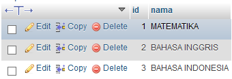

# **SQL Select**
***

## **A. Penjelasan**
Pernyataan SELECT digunakan untuk memilih data dari database.
Data yang dikembalikan disimpan dalam tabel hasil, yang disebut result-set.

 

* Projection : Memilih kolom-kolom dalam suatu tabel yang dihasilkan dari suatu query. Memilih beberapa atau banyak kolom yang dibutuhkan.

* Selection : Memilih baris-baris dalam suatu tabel yang dihasilkan dari suatu query. Banyak kriteria yang dapat digunakan untuk membatasi baris-baris yang akan diambil.

* Joining : Mengambil data bersama yang disimpan dalam tabel-tabel
***

## **B. Bentuk Syntax Umum**

Menampilkan semua data

		SELECT * FROM table_name;

Projection

		SELECT column1, column2, ...
		FROM table_name;

Selection
		
		SELECT * FROM [Table1] WHERE [Col1] = 'Result'

		SELECT Col1, Col2 FROM [Table1] WHERE [Col1] = 'Result'
***

## **C. Implementasi** 
* Desaigner Database :

		Database = db_magang_2
 

* Soal dan Penyelesaian :

**1. Menampilkan seluruh data di tabel siswa**

		SELECT * FROM siswa;

* Output 
 

**2. Menampilkan seluruh data di tabel mata pelajaran**

		SELECT * FROM mata_pelajaran;

* Output                                                    
 